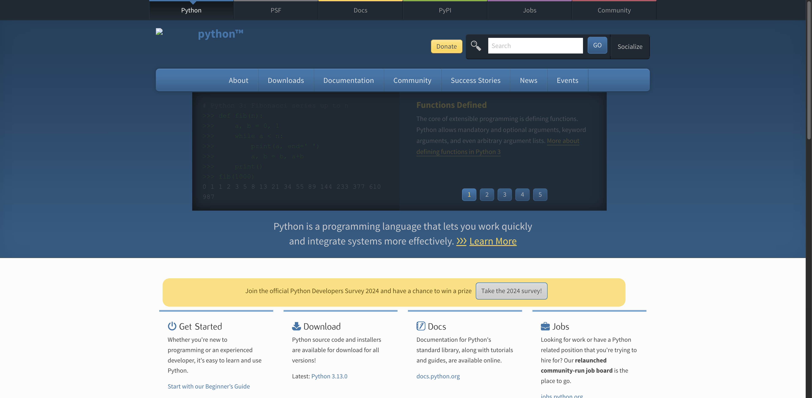

# webdrivers

## Install package

### Poetry

```
poetry add git+https://github.com/bigbossguru/webdriver-wrappers.git
```

### Pip

```
pip install git+https://github.com/bigbossguru/webdriver-wrappers.git
```

## Example

```
from webdrivers.chrome import WebDriverConnector

def main() -> None:
    with WebDriverConnector(headless=False, incognito=False, optimization=True) as driver:
        driver.get("https://python.org")
        driver.save_screenshot("./example.png")

if __name__ == "__main__":
    main()
```

### Result


